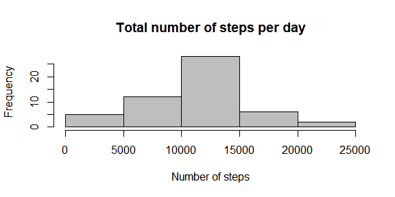
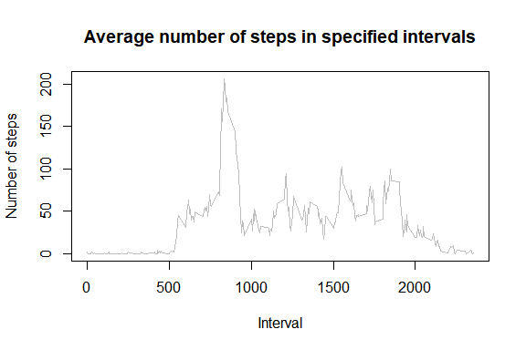
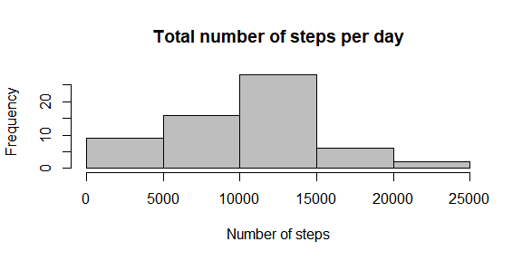
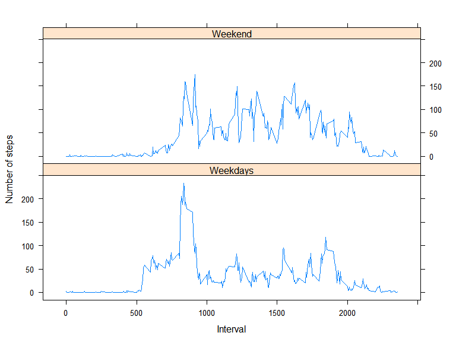

# Reproducible Research: Peer Assessment 1

## Loading and preprocessing the data

```r
library(downloader)
library(dplyr)
```

```
## 
## Attaching package: 'dplyr'
```

```
## The following objects are masked from 'package:stats':
## 
##     filter, lag
```

```
## The following objects are masked from 'package:base':
## 
##     intersect, setdiff, setequal, union
```

```r
library(lubridate)
```

```
## 
## Attaching package: 'lubridate'
```

```
## The following object is masked from 'package:base':
## 
##     date
```

```r
localFile <- 'activity.csv'
localArchive <- 'activity.zip'
remoteFile <- 'https://d396qusza40orc.cloudfront.net/repdata%2Fdata%2Factivity.zip'

# If the file doesn't exist locally yet, download and unzip it
if ( !file.exists(localArchive)) {
  download(remoteFile,
           destfile = localArchive)
}

# Do we need to unpack the archive?
if ( !file.exists(localFile)) {
  unzip(localArchive)
}

# Data ready, read it into a tibble
dataRaw <- tbl_df(read.csv(file = localFile,
                           sep = ',', 
                           stringsAsFactors = FALSE))

# Convert date field to actual date
dataSet <- mutate(dataRaw, date = ymd(date))
```

## What is mean total number of steps taken per day?

```r
# Group data by day for summarizing
dataGrouped <- group_by(dataSet, date)

# Calculate daily totals for histogram
dataTotal <- summarise(dataGrouped, 
                       totalSteps = sum(steps)
                       )
hist(dataTotal$totalSteps,
     main = 'Total number of steps per day',
     xlab = 'Number of steps',
     col = 'grey'
     )
```

<!-- -->

```r
# Calculate daily stats
dataTotal2 <- summarise(dataTotal, 
                        meanPerDay = mean(totalSteps, na.rm =TRUE),
                        medianPerDay = median(totalSteps, na.rm = TRUE)
                        )
```

- Daily mean of number of steps taken: 10766
- Daily median of number of steps taken: 10765

## What is the average daily activity pattern?

```r
# Group data by interval
dataGrouped <- group_by(dataSet, interval)

# Calculate mean
dataTotal <- summarise(dataGrouped, meanPerInterval = mean(steps, na.rm = TRUE))

# Construct plot
plot(x = dataTotal$interval,
     y = dataTotal$meanPerInterval,
     type = 'l',
     col = 'grey',
     xlab = 'Interval',
     ylab = 'Number of steps',
     main = 'Average number of steps in specified intervals')
```

<!-- -->

```r
# Determine interval with highest average
maxInd <- dataTotal[which.max(dataTotal$meanPerInterval), c('interval')]
maxVal <- max(dataTotal$meanPerInterval)
```

The interval that contains the highest average number of steps is 835, the actual average number of steps for that interval is 206.1698113

## Imputing missing values
A total of 2304 of NA values occur in our dataset.


```r
# Create a set with just NA values
# We want to fill the NA values with the median for that specific interval of the 2 days before and 2 days after the NA value

dataSet2 <- dataSet

for (i in 1:nrow(dataSet2)) {
  rowObj <- dataSet2[i, ]
  
  if (is.na(rowObj$steps)) {
      subSet <- 
          filter(dataSet, 
                 date >= (rowObj$date - days(2)) 
                 & date <= (rowObj$date + days(2)) 
                 & interval == rowObj$interval)

      dataSet2[i, ]$steps = round(median(subSet$steps, na.rm = TRUE), 0)
    }
}

# Recalculate steps per day and derived variables

# Group data by day for summarizing
dataGrouped <- group_by(dataSet2, date)

# Calculate daily totals for histogram
dataTotal <- summarise(dataGrouped, 
                       totalSteps = sum(steps)
                       )
hist(dataTotal$totalSteps,
     main = 'Total number of steps per day',
     xlab = 'Number of steps',
     col = 'grey'
     )
```

<!-- -->

```r
# Calculate daily stats
dataTotal2 <- summarise(dataTotal, 
                        meanPerDay = mean(totalSteps, na.rm = TRUE),
                        medianPerDay = median(totalSteps, na.rm = TRUE)
                        )
```

- Daily mean of number of steps taken: 10012
- Daily median of number of steps taken: 10395

## Are there differences in activity patterns between weekdays and weekends?


```r
library(lattice)

dataSet3 <- mutate(dataSet,
                   isWeekend = (weekdays(date, abbreviate = TRUE) == 'za') | (weekdays(date, abbreviate = TRUE) == 'zo'))

dataGrouped <- group_by(dataSet3, isWeekend, interval)
dataGrouped <- summarise(dataGrouped, meanSteps = mean(steps, na.rm = TRUE))

dataGrouped$isWeekend <- factor(dataGrouped$isWeekend)
levels(dataGrouped$isWeekend) <- c('Weekdays', 'Weekend')

xyplot(dataGrouped$meanSteps ~ dataGrouped$interval | dataGrouped$isWeekend,
       type = 'l',
       layout = c(1, 2),
       xlab = 'Interval',
       ylab = 'Number of steps')
```

<!-- -->

